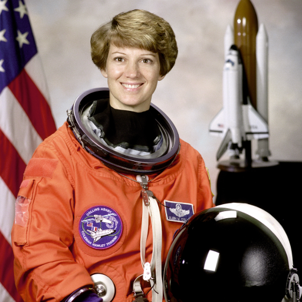
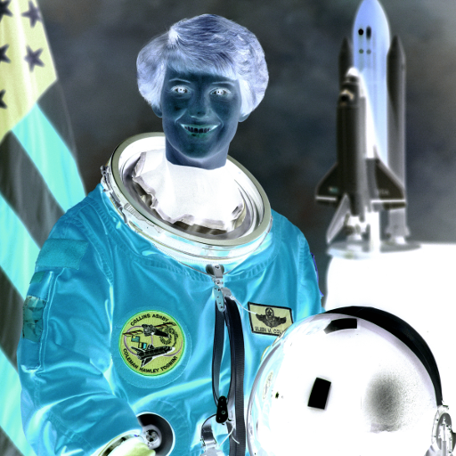
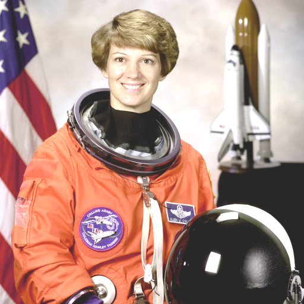
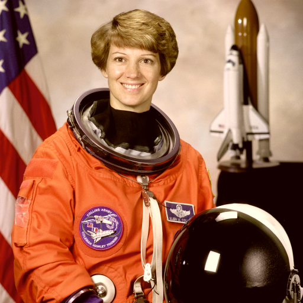
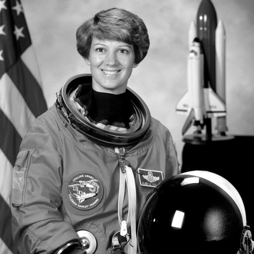

# 11. NumPyの応用：実画像を操作する

このページでは、実在するRGB画像をNumPyで操作します。

画像は、数値が並んだ配列として扱えます。

| 元画像 | 反転 | 明るくする | 色味を変える | グレースケール |
| --- | --- | --- | --- | --- |
|  |  |  |  |  |

出典: [scikit-image data.astronaut](https://scikit-image.org/docs/stable/api/skimage.data.html)

このページのコードでは、`image` という名前で画像が用意されているものとして進めます。

## まずは見る
### 画像の形を見る

RGB画像では、1つの画素が赤、緑、青の3つの値を持ちます。

それぞれの値は、よく `0` から `255` の整数で表されます。

```python
print(image.shape)
print(image.dtype)
```

`image.shape` は `(512, 512, 3)` です。

これは、512行、512列、3チャンネルの画像だと読めます。

最後の `3` が、赤、緑、青の3つの値を表しています。

### 1つの画素を見る

画像の1つの画素は、RGBの3つの値を持っています。

```python
pixel = image[100, 100]
red = image[100, 100, 0]
green = image[100, 100, 1]
blue = image[100, 100, 2]

print(pixel)
print(red)
print(green)
print(blue)
```

`image[100, 100]` は、100行目、100列目の画素を取り出しています。

`image[100, 100, 0]` は、その画素の赤成分です。

### 色チャンネルを取り出す

RGB画像では、最後の軸を指定すると赤、緑、青のチャンネルを取り出せます。

```python
red_channel = image[:, :, 0]
green_channel = image[:, :, 1]
blue_channel = image[:, :, 2]

print(red_channel.shape)
print(green_channel.shape)
print(blue_channel.shape)
```

`image[:, :, 0]` は、すべての行、すべての列について、0番目のチャンネルを取り出しています。

つまり、赤のチャンネルだけを取り出しています。

## 応用
### 色を反転する

画像の反転は、各値を `255 - 値` にすることで表現できます。

```python
inverted = 255 - image

print(inverted.shape)
print(inverted[100, 100])
```

NumPy配列では、`255 - image` と書くだけで、すべての値に対してまとめて計算できます。

### 明るくする

画像を明るくするには、すべての値に同じ値を足します。
`np.clip()` は、値の下限と上限を決めて、その範囲から外れた値を丸める関数です。

```python
bright = np.clip(image.astype(int) + 40, 0, 255).astype(np.uint8)

print(bright.shape)
print(bright[100, 100])
```

`np.clip(image.astype(int) + 40, 0, 255)` は、0より小さい値は0に、255より大きい値は255に丸めます。

画像の値は0から255の範囲に収めたいので、明るさを変えるときによく使います。

### 色味を変える

赤、緑、青のチャンネルに別々の値を足すと、画像の色味を変えられます。

```python
color_shift = np.array([20, 0, -20])
shifted = np.clip(image.astype(int) + color_shift, 0, 255).astype(np.uint8)

print(color_shift.shape)
print(shifted.shape)
print(shifted[100, 100])
```

`image` の形は `(512, 512, 3)` で、`color_shift` の形は `(3,)` です。

NumPyは、`color_shift` を最後の3チャンネルに合わせて、自動的に計算してくれます。

この仕組みをブロードキャストと呼びます。

### グレースケールにする

RGB画像を白黒画像のようにするには、赤、緑、青を1つの値にまとめます。

```python
gray = image.mean(axis=2).astype(np.uint8)

print(gray.shape)
print(gray[100, 100])
```

`axis=2` は、RGBのチャンネルの軸です。

`mean(axis=2)` によって、赤、緑、青の3つの値を平均し、1つの明るさに変えています。

RGBの3チャンネルが1つの明るさにまとまるので、3層あったものが1層になります。

計算後の `gray.shape` は `(512, 512)` になります。

## このページのまとめ

- RGB画像は `(高さ, 幅, 3)` のNumPy配列として読める
- `image[:, :, 0]` で赤チャンネルを取り出せる
- `255 - image` で画像を反転できる
- `np.clip()` で値を0から255の範囲に収められる
- チャンネルごとの色調変更ではブロードキャストが使われる
- `mean(axis=2)` でRGBチャンネルをまとめてグレースケールにできる
